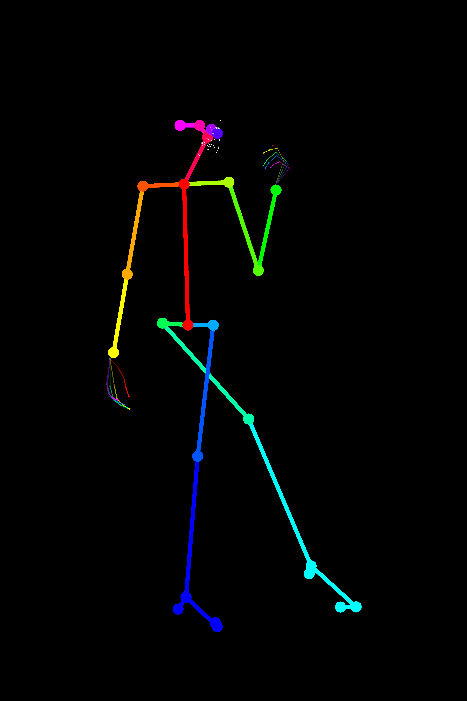

# README

## Inspiration & Reason

- I wanted to have a separte effort to see if I can run openpose loaclly on my __mac__.
- I was inspired by the [online openposeai viz](https://openposeai.com/?lng=en) but wanted something where I can use a webcam to take a snapshot and get opnepose skeleton back - a humble wish.
- But after spending a full day almost to try to compile `openpose` on my `mac M3` chip and dealing with outdated instructions and code base I was almost about to give up.
- But then I thought probably someone ported it via `docker` and for `ubuntu` (where it's supposed to compile easily) and even better, for `cpu` and not ~~`CUDA`~~

## What It Tries to Solve

- This project creates a `cpu` only openpose image in `Ubuntu 18` so that we can run it form `macOS`.
- This then exposes 3 API end points:
  - `/process` (`POST` req): Takes an image (and few other parameters - more on those below) processes it using one of the 3 openpose models (`BODY_25`, `COCO`, `MPI`) and gives us `openpose` skeleton data (images and json)
  - `/stop` (`POST`): Stops a running job
  - `/status` (`GET`): Gives us some ongoing staus
- This way we __do not have to deal with__ the aforementioned issues on `macOS`, especially.
- And any language agnostic client, capable of `HTTP` can send image and recveive openpose data

## What It Doesn't Do

- This project currently doesn't support realtime video streams as `x11` forwarding on `macOS` was bit of an issue.
- This project currently doesn't support analysis of video file from disk. Although if needed we can think about it. But I wanted a simple solution first.

> [!Tip]
> If you are interetsed in something alternative to openpose, you can chekout other projects such as [super-gradients with YOLO](https://github.com/Deci-AI/super-gradients/). But I just got stuck with openpose and this is waht we did here.

## Prerequisites

### Models

> [!Warning]
> __Model files from original source is unavailable__
>
> The repository doesn't come with the models and other supporting files themselves as they are too big for github. Additionally, the models from the true source [http://posefs1.perception.cs.cmu.edu/OpenPose/models/pose/]("http://posefs1.perception.cs.cmu.edu/OpenPose/models/pose/) are also not accessible anymore.

> [!Tip]
> __But there is Good News__
>
> They are available in [kaggle](https://www.kaggle.com/datasets/changethetuneman/openpose-model)

I have made a helper script ([prep.sh](prep.sh)) to make it easy to download the models and other files and store them in proper folder structure.

> [!Warning]
But for the ([prep.sh](prep.sh)) to work, you need to have a `kaggle account` and `kaggle cmdline tool` installed.

#### Steps to Setup Kaggle

- Go to [kaggle.com](https://www.kaggle.com) and create an account, verify your account and create an `API_KEY`. Don't worry it's free.
- After creating the `API_KEY` you will have to donwload the `kaggle.json` to a suitable location.
- Then do `mkdir -p ~/.kaggle` and copy the `kaggle.json` there.
- For example, if you downloaded it in your `Downloads/` directory then simply to `mv <PATH TO DOWNLOADS DIRECTORY>/kaggle.json ~/.kaggle` and verify by typing `ls ~/.kaggle`.
- This needs to be done because `kaggle cmdline tool` looks for API credentials in PATH `~/.kaggle/kaggle.json`
- Now install `kaggle cmdline tool` by typing: `python3 -m pip install kaggle` or `pip install kaggle`.
- Kaggle setup should be done now. You can verify by typing: `kaggle datasets files changethetuneman/openpose-model`

#### Steps to Setup Expected Directories and Download Models and Other Files In Them

```bash
$ git clone git@github.com:zigzagGmbH/openpose_local_cpu_docker_api.git
$ cd openpose_local_cpu_docker_api
$ ./pre.sh
```

It will then prepare the [models/](models) dir and download all the necessary files in required sub-dirtectories

After completion, it should look liek this

```txt
├── models
│   ├── face
│   │   ├── pose_deploy.prototxt
│   │   └── pose_iter_116000.caffemodel
│   ├── hand
│   │   ├── pose_deploy.prototxt
│   │   └── pose_iter_102000.caffemodel
│   └── pose
│       ├── body_25
│       │   ├── pose_deploy_linevec_faster_4_stages.prototxt
│       │   ├── pose_deploy_linevec.prototxt
│       │   ├── pose_deploy.prototxt
│       │   └── pose_iter_584000.caffemodel
│       ├── coco
│       │   ├── pose_deploy_linevec.prototxt
│       │   └── pose_iter_440000.caffemodel
│       └── mpi
│           ├── pose_deploy_linevec.prototxt
│           └── pose_iter_160000.caffemodel
```

### Docker

Well, make sure your docker and docker-cli is insatlled and up and running. You might also need to loginto your docker a/c first.

## Installation

Make the docker image

```bash
# --> Login (Probably needed)
# docker login

# --> Check the Linux Image (Probably needed)
# docker pull ubuntu:18.04

# Start
COMPOSE_BAKE=true docker-compose up --build -d
# First time it will takle some time as it is creating a fresh image

# Check it ...
docker-compose ps
docker ps

# Now openpose should be compiled ...
# Test  
docker exec openpose_local_cpu_docker_api-openpose-api-1 /openpose/build/examples/openpose/openpose.bin --help
# If that works i.e. if you see a bunch of help dump, try an inference
docker exec openpose_local_cpu_docker_api-openpose-api-1 /openpose/build/examples/openpose/openpose.bin --image_dir /images --write_images /images/output/ --display 0 

# Stop
docker-compose down
```

> [!Tip]
> When the docker image is running, you can check the log files by typing

```bash
docker logs -f open_pose_cpu_api_docker-openpose-api-1
```

## Usage

What the above compose cmd does is that when the docker image is running it uses [openpose_api_server.py](openpose_api_server.py) which watches for `HTTP` requestes and for specific `GET`/`POST` requests, it then runs/stops the compiled `openpose.bin` file execution or reports execution status.

> [!Tip]
> For the next steps I highly suggest installing [httpie](https://httpie.io/) although you can check HTTP APIs via CURL directly from cmdline

### Sending a post request to our openpose docker image API

METHOD:

`POST`

URL:

`http://127.0.0.1:2500/process`

BODY:

> Basic example

```json
{
  "image_path": "/images/test.jpg",
  "output_dir": "/images/output"
}
```

EXPECTED RESPONSE:

```json
{
  "message": "Image processing started",
  "options": {
    "detect_face": false,
    "detect_feet": false,
    "detect_hands": false,
    "face_render_threshold": 0.4,
    "feet_render_threshold": 0.03,
    "hand_render_threshold": 0.2,
    "keypoint_scale": 0,
    "model": "BODY_25",
    "render_on_black": true,
    "render_on_image": true,
    "render_threshold": 0.05,
    "write_json": true
  },
  "status": {
    "current_image": null,
    "is_processing": true,
    "progress": 0,
    "status_message": "Starting to process image: /images/test.jpg"
  },
  "success": true
}
```

### Stopping an ongoing process

METHOD:

`POST`

URL:

`http://127.0.0.1:2500/stop`

EXPECTED RESPONSE:

```json
{
  "message": "Processing stopped",
  "status": {
    "current_image": "/images/test.jpg",
    "is_processing": false,
    "progress": 100,
    "status_message": "Processing stopped by user"
  },
  "success": true
}
```

### Status of an ongoing process

METHOD:

`GET`

URL:

`http://127.0.0.1:2500/status`

EXPECTED RESPONSE:

1. Idle

```json
{
  "current_image": null,
  "is_processing": false,
  "progress": 0,
  "status_message": "Idle"
}
```

2. Process ongoing

```json
{
  "current_image": "/images/test.jpg",
  "estimated_completion": "JSON output complete, finalizing processing...",
  "is_processing": true,
  "keypoint_stats": {
    "has_face_keypoints": true,
    "has_feet_keypoints": true,
    "has_hand_keypoints": false,
    "model_used": "BODY_25",
    "num_people_detected": 1
  },
  "outputs": {
    "json": [
      "/images/output/json/test_keypoints.json"
    ],
    "rendered_on_black": [
      "/images/output/black_bg/test_rendered.png"
    ],
    "rendered_on_image": [
      "/images/output/on_image/test_rendered.png"
    ]
  },
  "progress": 30,
  "status_message": "Starting thread(s)..."
}
```

3. Job stopped

```json
{
  "current_image": "/images/test.jpg",
  "is_processing": false,
  "keypoint_stats": {
    "has_face_keypoints": true,
    "has_feet_keypoints": true,
    "has_hand_keypoints": false,
    "model_used": "BODY_25",
    "num_people_detected": 1
  },
  "outputs": {
    "json": [
      "/images/output/json/test_keypoints.json"
    ],
    "rendered_on_black": [
      "/images/output/black_bg/test_rendered.png"
    ],
    "rendered_on_image": [
      "/images/output/on_image/test_rendered.png"
    ]
  },
  "progress": 100,
  "status_message": "Processing stopped by user"
}
```

### Undserstanding

Various option available to you as part of the `BODY` for the `/process` end-point of the `POST` request

```
{
  "image_path": "/images/test.jpg",           // Required: Path to image within container
  "output_dir": "/images/output",             // Optional: Output directory (default: /images/output)
  
  // Model selection
  "model": "BODY_25",                         // Optional: Model type (BODY_25, COCO, MPI) (default: BODY_25)
  
  // Body part detection options
  "detect_face": false,                       // Optional: Enable face detection (default: false)
  "detect_hands": false,                      // Optional: Enable hand detection (default: false)
  "detect_feet": false,                      // Optional: Enable hand detection (default: false)
  
  // Output types
  "render_on_black": true,                    // Optional: Generate skeleton on black background (default: true)
  "render_on_image": true,                    // Optional: Generate skeleton on original image (default: true)
  "write_json": true,                         // Optional: Generate JSON keypoint data (default: true)
  
  // Detection thresholds
  "render_threshold": 0.05,                   // Optional: Body keypoint confidence threshold (default: 0.05)
  "face_render_threshold": 0.4,               // Optional: Face keypoint confidence threshold (default: 0.4)
  "hand_render_threshold": 0.2,               // Optional: Hand keypoint confidence threshold (default: 0.2)
  
  // Coordinate scaling
  "keypoint_scale": 0                         // Optional: Coordinate scale in JSON output (default: 0)
                                              // 0=original resolution, 3=normalized [0,1], 4=normalized [-1,1]
}
```

The `keypoint_scale` parameter only affects the JSON output, not the rendered images. That's why you'll not see visual differences.

- With keypoint_scale: 0: Coordinates in JSON are in pixel values (e.g., x: 320, y: 240)
- With keypoint_scale: 3: Coordinates in JSON are normalized to [0,1] range (e.g., x: 0.33, y: 0.45)

### Model Compatibility Notes

- `BODY_25`: Supports all features (face, hands, feet)
- `COCO`: Basic pose detection; face/hand detection may be unstable
- `MPI`: Basic pose detection; face/hand detection may be unstable

So if we send a `BODY` as follows

```json
{
  "image_path": "/images/test.jpg",
  "output_dir": "/images/output",
  "model": "BODY_25", 
  "detect_face": true,                       
  "detect_hands": true,                     
  "detect_feet": true,                      
}
```

Then we would see output as such

| source image| rendered on image | just skeleton |
| --- | --- | -- |
|  |  |  |


---

## LICENSE

[MIT](LICENSE)

## Attribution

- [openpose (original)](https://github.com/CMU-Perceptual-Computing-Lab/openpose)
- [docker-openpose-cpu](https://github.com/seancook/docker-openpose-cpu/)